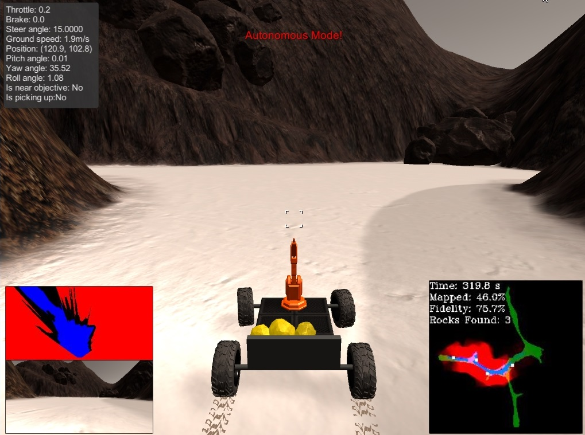

# **Robotics Nanodegree**

# **Term1 – Project1: Search and Sample Return Project** #
 #

## **INTRODUCTION** ##

This project is modeled after the [NASA sample return
challenge](https://www.nasa.gov/directorates/spacetech/centennial_challenges/sample_return_robot/index.html) and
the purpose is to practice the three essential elements of robotics:

-perception

-decision making

-actuation

## **Perception** ##

The objective of the perception system of the Rover is to create a map
of the environment. The perception approach followed a “pipeline”
function using the images obtain by the Rover. The steps on this
pipeline were:

1-Perspective transform

-Define source and destination and warp image

2-Color threshold: light colors(navigable), dark(obstacles), and
yellow(rocks)

3-Convert color-coded image to Rover C.S.

4-Convert Rover C.S. image to World C.S.

5-Update existing Map with color-coded World C.S. values

<video src="./media/robotND1-proj1_README_video1.mp4" width=640 controls>
</video>

## **Decision** ##

The objective of the decision system of the Rover is to set the values
for brake, throttle, steer, and mode(state), so that it can navigate
thru the newly encountered terrain.

-If the Rover is moving, determine if there is enough distance in front
to keep moving. Set speed, no braking, and steer(average of the
navigable terrain angles in front).

-If Rover is stopped. If speed is high, keep braking. If speed is low,
depeding on the navigable distance in front: just rotate or speed up and
steer.

## **Decision – rock pickup** ##

Rock pickup is WIP. To enable it uncomment lines 59-84 on decision.py.

## **FILES** ##

Code\\ Rover\_Project\_Test\_Notebook01.py -&gt; Simple version of the
Jupyter Notebook

Code\\ Rover\_Project\_Test\_Notebook02.ipynb -&gt; Jupyter Notebook of
the perception pipeline

Code\\ decision.py -&gt; updated file with decision making logic

Code\\ drive\_rover.py -&gt; not modified, used to launch connection to
simulator

Code\\ perception.py -&gt; modified with perception pipeline functions

Code\\ supporting\_functions.py -&gt; not modified

## **Conclusions** ##

-   The Rover was successful at mapping the new environment using a
    simple perception pipeline of warping, thresholding, C.S transform
    in to a new map.

-   The Rover was able to navigate through the newly found terrain using
    a very simple logic system broken into 2 main conditional
    statements: Rover moving or Rover stopped.

-   The rock pickup function is WIP, but when enabled is successful at
    stopping near the rocks and picking them up. A little more work is
    needed for situations in which the Rover gets stuck in obstacles.

